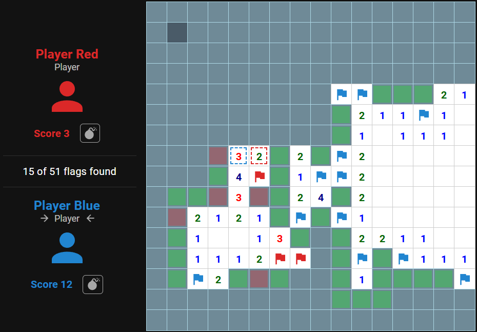

# Installation

## Step 1

Go to your extensions page
chrome:extensions | vivaldi:extensions

## Step 2

Enable developer mode

## Step 3

Load unpacked and select the extension folder inside the repo

## Step 4

Profit

